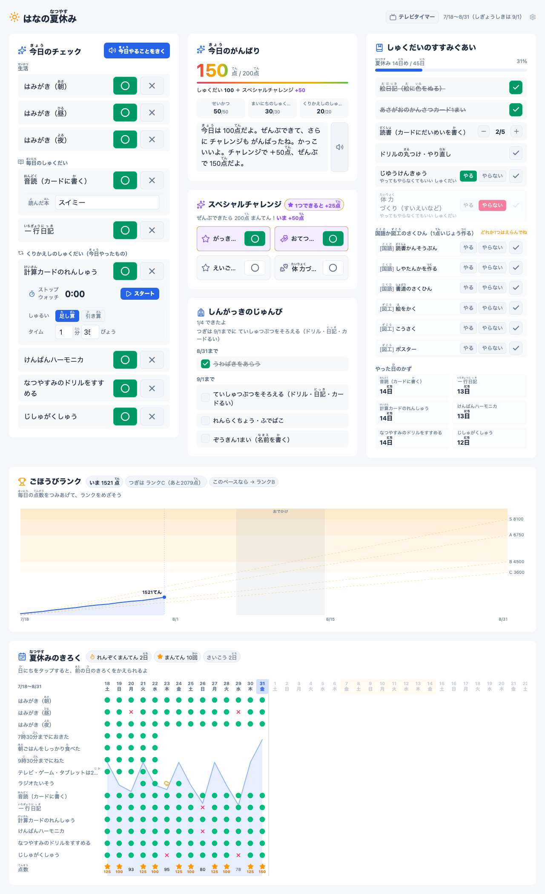
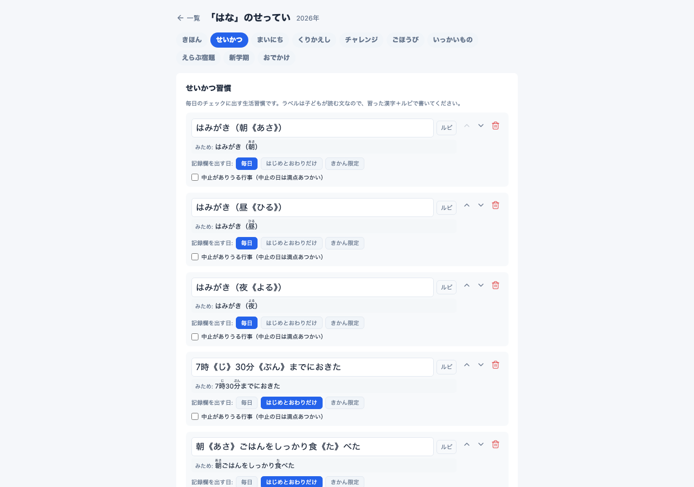

# なつやすみボード（natsuyasumi-board）

小学生の夏休みの宿題と生活習慣を、子どもが自分でチェックできる家庭内ダッシュボードです。
リビングのタブレットや古いスマホに表示しておけば、子どもは毎日「やった◯／やらなかった✕」を
押すだけ。100点満点の採点・満点の花火・ごほうびランク・履歴のスタンプラリーで、
夏休みの宿題をやる動機づけができます。



## まずは開いてみる（インストール不要）

**https://0msys.github.io/natsuyasumi-board/**

ブラウザだけで動く lite 版です。サーバもインストールも要りません。記録はその端末の
ブラウザの中に保存され、どこにも送信されません。

使うタブレット・スマホでは、**「ホーム画面に追加」しておいてください。** ブラウザのままだと、
しばらく開かなかったときに端末側の掃除で記録が消えることがあります（iOS Safari は
7日間ひらかなかったサイトの保存データを消します）。ホーム画面から開くアプリはその対象外です。

念のため、ときどき管理画面（右上の歯車）から「バックアップする」を押して、ファイルに
出しておいてください。端末を替えるときも、そのファイルから「もどす」で引き継げます。

lite 版に無いものは2つだけです。

- **複数の端末で記録が同期しません**（リビングのタブレットと親のスマホは、それぞれ別の記録になります）
- **音声読み上げがありません**（VOICEVOX はサーバ側の機能のため）

この2つが要るなら、下の Docker 版を使ってください。中身の採点・画面・管理機能は同じものです。

## 機能

- **きょうのチェック** — 生活習慣（はみがき・早寝早起きなど）と宿題を3値（やった／やらなかった／未記入）で記録。大きなボタン・スタンプ演出・効果音つき
- **100点満点の採点** — せいかつ50点＋しゅくだい50点を自動採点。満点で全画面の花火
- **スペシャルチャレンジ** — 100点をとった日だけ解放されるボーナス枠（おてつだい・うんどうなど、1つ+25点）
- **ごほうびランク** — 夏休み全体の積み上げ点数でランクC→B→A→Sを判定。自作SVGの進捗グラフつき
- **履歴グリッド** — 期間全日のチェック履歴と連続満点ストリーク。過去の日をタップして修正もできる
- **テレビタイマー** — テレビ・ゲームの視聴時間を計測（上限は子どもごとに設定・既定2時間・複数端末で共有）
- **総ルビ表示** — すべての表示は「漢字《よみ》」記法のふりがな付き。学年（小1〜小6）に応じて
  使う漢字を配当表の範囲に制限し、管理画面が配当外の漢字を教えてくれる。
  初回ウィザードの標準テンプレも、選んだ学年の配当に合わせた項目名で入る
- **きょうのがんばりコメント** — スコアに応じた褒めメッセージを毎日表示（学年に応じた口調）
- **音声読み上げ（オプション）** — [VOICEVOX](https://voicevox.hiroshiba.jp/) があれば「きょうやること」や褒めコメントを読み上げ
- **管理画面** — 子ども・期間・宿題・ごほうびを全部ブラウザから登録。YAML や JSON を書く必要はありません

## しくみ

```
ブラウザ（タブレット・スマホ）
   │ http://<ホスト>:8082
   ▼
frontend（SvelteKit）──/api──▶ backend（FastAPI）──▶ SQLite（./data/summer.db）
                                    │                    定義＋チェック記録
                                    └──（あれば）VOICEVOX Engine（音声合成）
```

- 定義（子ども・期間・項目）は管理画面から登録し、SQLite に保存されます
- チェック記録はサーバ権威なので、リビングのタブレットと親のスマホで同じ状態が見えます
- 採点は決定的（LLM・外部サービス不使用）。インターネット接続なしで動きます

lite 版はここからサーバを外し、同じ計算を画面側で行います。

```
ブラウザ（タブレット・スマホ）
   │ https://0msys.github.io/natsuyasumi-board/
   ▼
frontend（SvelteKit・静的サイト）──▶ IndexedDB（その端末の中）
   採点・文言・検証も画面側で行う          定義＋チェック記録
```

採点や画面文言のもとになる計算は、バックエンドの Python と画面側の TypeScript の
両方にあります。同じ答えを返すことは、Python の実際の出力を金型として固め、
TypeScript 側のテストで突き合わせて担保しています（`frontend/src/lib/core/__golden__/`）。

## Docker で動かす（複数端末で記録を共有したいとき）

常時つけっぱなしにできる PC がある場合の動かしかたです。家の中の端末から同じ記録が見え、
VOICEVOX を足せば読み上げも使えます。


起動時に管理API(`/api/admin/*`)の保護方針を必ず選びます。次のどちらかで起動してください。
どちらも指定しないと、無防備な管理APIを黙って公開しないよう起動が中止されます。

```bash
git clone https://github.com/0msys/natsuyasumi-board.git
cd natsuyasumi-board

# 1) いたずら防止の PIN を掛けて起動（推奨）
ADMIN_PIN=1234 docker compose up --build

# 2) PIN なしで起動（家庭内LAN専用。下の「セキュリティについて」を必読のうえ承知して選ぶ）
ADMIN_NO_AUTH=1 docker compose up --build
```

`http://<ホストのIP>:8082` を開くと、初回は登録ウィザードが立ち上がります。
子どもの名前・学年・夏休みの期間を入れて「標準ではじめる」を選べば、
はみがき・早寝早起き・宿題の代表例が入った状態で始まります。
入る項目名は選んだ学年に合わせた書きかたになります
（小1なら「おんどく」、小5なら「音読《おんどく》」——項目や点数は全学年同じ）。
あとは管理画面（右上の歯車）で、学校からのお知らせに合わせて宿題を足してください。

- 音声読み上げも使う場合は、上のどちらかに `--profile voice` を足します:
  `ADMIN_PIN=1234 docker compose --profile voice up --build`
  （VOICEVOX のコンテナが一緒に起動します。初回はモデルのダウンロードで時間がかかります）
- `ADMIN_PIN` は子どもが設定画面をいじるのを防ぐ簡易ゲートです（認証ではありません。
  詳しくは「セキュリティについて」を参照）
- データは `./data/` に保存されます。バックアップはこのフォルダをコピーするだけです

### すぐに動きを見たい（サンプルデータ）

管理画面（`/admin`）の「インポート」から `docs/examples/2026-はな.json` を読み込むと、
架空の小学2年生「はな」の設定一式（宿題・選択課題・ごほうびランク）が入ります。

## 管理画面ガイド



`/admin` で子どもの一覧、`/admin/new` で新規登録、各子どもの編集画面はタブで区切られています:

| タブ | 登録するもの |
|---|---|
| きほん | よみがな・学年・夏休みの期間・始業式・よみあげの こえ（VOICEVOX のキャラクター） |
| せいかつ | 毎日の生活習慣（「はじめとおわりだけ」の日数・テレビタイマーの上限もここ） |
| しゅくだい | 毎日の宿題（メモ欄の定義もできる: 読んだ本・計算タイムなど） |
| チャレンジ | 100点で解放されるボーナス項目 |
| ごほうび | ランクと1日平均点の目安（到達点数は自動計算） |
| いっかいもの | 一回だけの宿題（絵日記など。読書は「かずをかぞえる」型で冊数目標） |
| えらぶ宿題 | 「どれか1つ以上」の選択課題（読書感想文か絵か…） |
| 新学期 | 始業式のもちもの・じゅんびチェックリスト |
| おでかけ | 帰省・旅行の期間（履歴に「おでかけ」表示。責めない設計です） |

- ラベルに学年で習っていない漢字を使うと、その場で教えてくれます（ひらがな推奨）
- ふりがなは「漢字《よみ》」の形で書きます（例: `音読《おんどく》`）。プレビュー付き
- 設定の書き出し（エクスポート）と読み込み（インポート）ができるので、
  兄弟への流用や、他の家庭との共有もファイル1つでできます
- **来年ぶんは前年からコピーできます**（一覧のカレンダー＋アイコン）。項目はそのままに、
  きかん・始業式・じゅんびの締切が1年あと、学年が1つ上になった定義ができます。
  記録は引きつがれません（去年の「絵日記できた」が今年も済みにならないよう、
  項目のキーごと新しくします）。おでかけの予定は空になります。
  年が複数あると編集画面に年タブが出て、去年ぶんも直せます。
  子どもページに出るのは「今日を含むきかんの年」なので、夏の最中に来年ぶんを作っても
  画面は今年のままです（夏が終わったあとはその年を見返せます）
- 期間の途中で項目を増減すると過去の日の点数の見え方が変わるため、保存時に警告が出ます
  （記録そのものは消えません）

## 手動セットアップ（Docker を使わない場合）

必要なもの: [uv](https://docs.astral.sh/uv/)・[Bun](https://bun.sh/)

管理API の保護方針は Docker のときと同じく必須です（未設定だと管理APIは全部 403 になり、
初回登録のウィザードも保存できません）。

```bash
# バックエンド（port 8000）。ADMIN_PIN か ADMIN_NO_AUTH のどちらかを必ず指定する。
# --host 127.0.0.1 で「フロントの中継からしか届かない」状態にし、その前提で
# TRUST_PROXY_CLIENT_HEADER=1 を立てる（管理PINの総当たり対策を端末ごとに効かせるため）
cd backend && uv sync && ADMIN_PIN=1234 TRUST_PROXY_CLIENT_HEADER=1 \
  uv run uvicorn app.main:app --host 127.0.0.1 --port 8000
#   PIN なしで使うなら ADMIN_PIN=1234 の代わりに ADMIN_NO_AUTH=1

# フロントエンド（port 8082・別ターミナルで）
cd frontend && bun install && bun run dev
```

`--host 0.0.0.0` で backend を LAN に直接さらす場合は、`TRUST_PROXY_CLIENT_HEADER` を
**立てないでください**（`x-real-client` を詐称して総当たり対策を回避できます）。ただしその
場合は全端末のスロットルが1つに潰れ、誤PINの連投で管理画面に入れなくなります。
backend を直接公開しないほうが安全です。

音声読み上げは [VOICEVOX](https://voicevox.hiroshiba.jp/) をローカルで起動しておけば自動で有効になります
（既定の接続先 `http://localhost:50021`。環境変数 `VOICEVOX_URL`・`VOICEVOX_SPEAKER` で変更可能）。
読み上げの声は子どもごとに管理画面の「きほん」タブで選べます（`VOICEVOX_SPEAKER` はその既定値）。

## 採点ルール

- 1日の基本点は100点: **せいかつ50点＋しゅくだい50点**。
  どちらも「やった数 ÷ 項目数」の割合で按分（四捨五入）＝宿題はどの項目も同じ重み
- どちらかのカテゴリが空（項目0件）だと、そのカテゴリは0点固定になり100点に届きません
  （満点スタンプ・れんぞく満点・スペシャルチャレンジが出なくなるので、管理画面が警告します）
- 「はじめとおわりだけ」の習慣（早寝早起きなど）は、期間の最初と最後の n 日間（既定5日）だけ記録欄が出ます
- 「中止がありうる行事」（ラジオ体操など）は雨天中止の日を「中止」と記録でき、満点扱いになります
- 基本点が100点の日だけ、スペシャルチャレンジ1つにつき **+25点** のボーナス
- ごほうびランクは夏休み全体の積み上げ点数で判定します（到達点数 = 1日平均点の目安 × 期間日数）

## 音声読み上げと VOICEVOX の利用規約

音声合成には [VOICEVOX](https://voicevox.hiroshiba.jp/)（無料）を使います。既定の話者はずんだもんです。
生成した音声の利用には [VOICEVOX の利用規約](https://voicevox.hiroshiba.jp/term/) と各キャラクターの
規約が適用されます（家庭内利用は問題ありませんが、音声を公開する場合は「VOICEVOX:ずんだもん」のような
キャラクター名のクレジット表記が必要です）。

**声は子どもごとに変えられます**。管理画面の「きほん」タブでキャラクターとはなしかたを選び、
「ためし聞き」で確かめてから保存してください（VOICEVOX が起動しているときだけ一覧が出ます）。
選ばなかった子どもは環境変数 `VOICEVOX_SPEAKER`（未設定なら 3＝ずんだもん）の声で読み上げます。

## セキュリティについて（重要）

### lite 版（https://0msys.github.io/natsuyasumi-board/）

記録はその端末のブラウザの中だけにあり、どこにも送信されません。サーバが無いので、
外から見られることも書き換えられることもありません。

**lite 版に PIN はありません。** docker 版の PIN は「サーバが受け付けない」ことで効いていた
仕掛けで、画面だけの lite では隠しても意味がないため置いていません。子どもがさわる端末では、
端末側の機能（スクリーンタイム・アプリのロックなど）で制限してください。

### Docker 版

こちらは**家庭内 LAN 専用**です。ログイン機構はありません。

- 起動時に `ADMIN_PIN`（PIN ゲート）か `ADMIN_NO_AUTH=1`（PIN なし運用の明示オプトイン）の
  どちらかを必ず選びます。どちらも未指定だと起動が中止され、無防備な管理APIが公開ポート 8082
  越しに黙って公開されることはありません
- **インターネットに公開しないでください**（ルーターのポート転送・リバースプロキシでの公開は厳禁）
- `ADMIN_PIN` は子どもが設定画面をいじるのを防ぐためのもので、**認証ではありません**
- 管理 API（`/api/admin/*`）は既定でフェイルクローズです。`ADMIN_PIN` を設定するか、
  認証なしの家庭内 LAN モードを使う場合は `ADMIN_NO_AUTH=1` を**明示的に**指定してください。
  どちらも設定しないと、定義の作成・保存・削除・インポート・記録の物理削除などの
  管理操作はすべて拒否されます（既定で開放はしません）
- 家の外から使いたい場合は [Tailscale](https://tailscale.com/) などの VPN を利用してください

## 開発

```bash
cd backend && uv run pytest        # バックエンドのテスト
cd backend && uv run ruff check app tests tools
cd frontend && bun run check       # svelte-check（docker 版のビルド設定で）
cd frontend && bun run check:lite  # svelte-check（lite 版のビルド設定で）
cd frontend && bun run test        # 単体・コンポーネント・金型のテスト
cd frontend && bun run dev         # docker 版の開発サーバ（要 backend）
cd frontend && bun run dev:lite    # lite 版の開発サーバ（backend 不要）
cd frontend && bun run build       # docker 版（build/ へ・adapter-node）
cd frontend && bun run build:lite  # lite 版（build-lite/ へ・静的サイト）
```

通しで動かすスモークが2本あります（Playwright）。

```bash
# docker 版（backend + frontend を起動しておく）
BASE=http://127.0.0.1:8082 CHILD=はな uv run --with playwright python e2e/smoke_child_page.py
# lite 版（bun run build:lite && bun run preview:lite しておく）
uv run --with playwright python e2e/smoke_lite.py
```

フロントのテストは `bun run test` で実行してください（素の `bun test` では動きません）。
コンポーネントを描画して検査するために svelte をブラウザ側へ解決する必要があり、その指定は
bunfig.toml では効かず `package.json` の `test` スクリプトが `--conditions browser` を
渡しています。間違えた場合は理由を書いたエラーで止まります（`src/test-setup.ts`）。
1本だけ走らせるときも同じで、`bun run test src/lib/summer/ruby.test.ts` のように渡します。

### 2つの版があること

画面（`frontend/src/`）は1つで、保存と計算のやりかただけを差し替えています。

- `frontend/src/lib/api/client.ts` — docker 版。`/api` を叩く（計算はバックエンド）
- `frontend/src/lib/api/local/` — lite 版。`frontend/src/lib/core/` で計算し `frontend/src/lib/store/` に保存する

どちらが入るかは `svelte.config.js` の `kit.alias.$apiImpl` が決めます（環境変数 `NYB_TARGET`）。
両方が `frontend/src/lib/api/contract.ts` の `Api` 型を満たすので、片方だけ足したりずらしたりすると
`bun run check` / `check:lite` が落ちます。

**採点・文言・検証の挙動を変えるときは、必ずバックエンド（Python）から直してください。**
生成物と金型を作り直して差分を反映するのが正しい順序です。

```bash
cd backend && uv run python tools/dump_core_data.py  # 配当漢字・画面文言などのデータ
cd backend && uv run python tools/dump_golden.py     # 入力と出力の金型
cd frontend && bun run test                          # TS 側が金型と一致するか
```

CI はこの2つを再生成して `git diff --exit-code` します。つまり「Python を直して TS を忘れた」は
止まりますが、**逆（TS だけ直す）は止まりません**。順序を守るのは人間側の約束です。

定義データの JSON 形式（エクスポート/インポート）は [docs/definition-format.md](docs/definition-format.md) を参照してください。

## 出典・謝辞

- 学年別漢字配当表: 文部科学省 小学校学習指導要領（平成29年告示）別表（計1,026字）
- 音声合成: [VOICEVOX](https://voicevox.hiroshiba.jp/)（ヒホ氏）

## 今後の予定

- 使われなくなった記録の整理 UI（項目を消したあとに残る記録を掃除する画面。
  API（`purge-orphans`）はありますが、まだ画面からは呼べません）

## ライセンス

[MIT](LICENSE)
